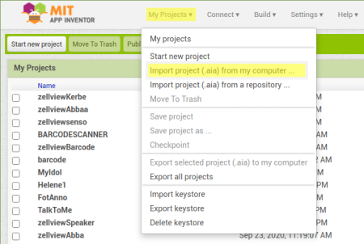
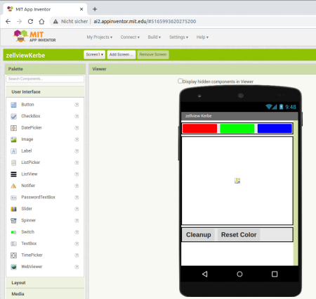
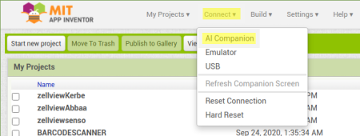
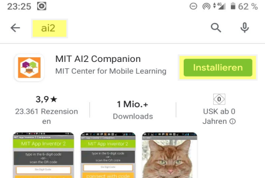
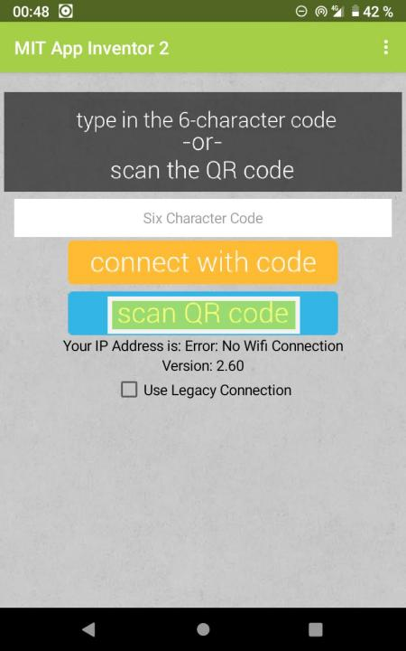
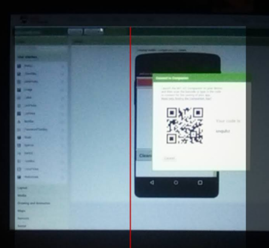
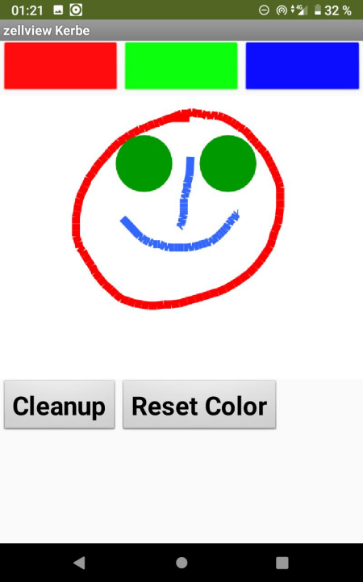

## zellviewKerbe  

is a simple android-app.

It shows the use of buttons and canvas.

1. download the project-file [zellviewKerbe.aia](https://zellview.net/kerbe/zellviewKerbe.aia)

1. start [AppInventor2](http://ai2.appinventor.mit.edu)

1. goto menu 
__My Projects -> Import project(.aia) from my Computer__  
  
and select __zellviewKerbe.aia__ from your download-directory.  
Here we are.  
  

1. goto menu __Connect -> AI companion__  
  
and get here  
  

1. search in Google-Play-Store for __AI2__ and install  
__MIT AI2 Compnaion__ on the android-phone.  

1. start companion app and select __scan QR code__  
  

1. snapshot the code on the screen  
  

## enjoy and happy coding  

